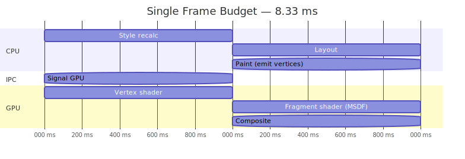
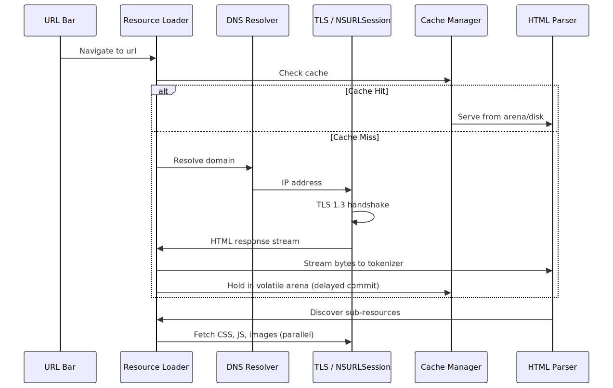

# System Architecture Document
## Metal — macOS-Native Browser Engine

| Field | Value |
|---|---|
| **Version** | 0.1.0-draft |
| **Date** | 2026-03-03 |

---

## 1. High-Level Architecture

---

## 2. Process Model

| Process | Responsibilities | Sandboxed |
|---|---|---|
| **UI Process** | Window management, tab bar, URL bar, user input dispatch | Minimal |
| **Renderer (×N)** | HTML parsing, CSS resolution, layout, JS execution, paint | **Yes** — no filesystem/network |
| **GPU Process** | Metal command encoding, texture management, compositing | Yes |
| **ML Process** | Core ML inference, MLX LLM, cache predictions | Yes |

---

## 3. Memory Architecture

### 3.1 Unified Memory Strategy

### 3.2 Arena Allocation Per Tab

### 3.3 Allocator Hierarchy

| Allocator | Scope | Freed When |
|---|---|---|
| **Page Allocator** | Large assets (images, WASM binaries, IOSurface) | Asset evicted |
| **Arena Allocator** | Per-tab DOM, CSS, layout data | Tab closed / navigated |
| **Fixed Buffer** | HTTP headers, IPC messages, small strings | End of function scope |
| **GPA (debug only)** | All allocations during development | Leak detection |

---

## 4. Rendering Pipeline

### 4.1 Frame Lifecycle (120 Hz target = 8.33 ms budget)

---

## 5. JavaScript Engine Architecture

---

## 6. Networking & Resource Loading

---

## 7. QoS Thread Distribution

---

## 8. Component Dependency Matrix

| Component | Depends On | Depended By |
|---|---|---|
| `platform/` | AppKit, Metal, macOS APIs | Everything |
| `dom/` | `platform/` (allocators) | `css/`, `layout/`, `js/`, `devtools/` |
| `css/` | `dom/` | `layout/` |
| `layout/` | `css/`, `dom/` | `render/`, `devtools/` |
| `render/` | `layout/`, `platform/` (Metal) | `ui/`, `ipc/` |
| `js/` | `dom/`, `platform/` (JSC/QuickJS) | `ui/` |
| `net/` | `platform/` (NSURLSession) | `dom/`, `ui/` |
| `ipc/` | `platform/` (Mach, shm) | `render/`, `net/`, `ui/` |
| `ui/` | `render/`, `net/`, `js/` | User-facing |
| `ml/` | `platform/` (CoreML, MLX) | `net/`, `devtools/` |
| `devtools/` | `dom/`, `layout/`, `render/`, `js/` | User-facing |
